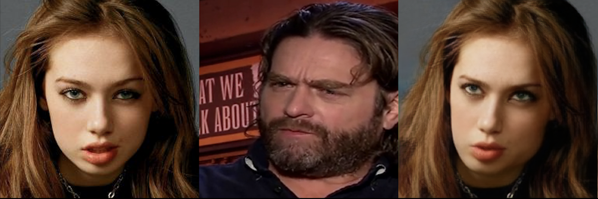
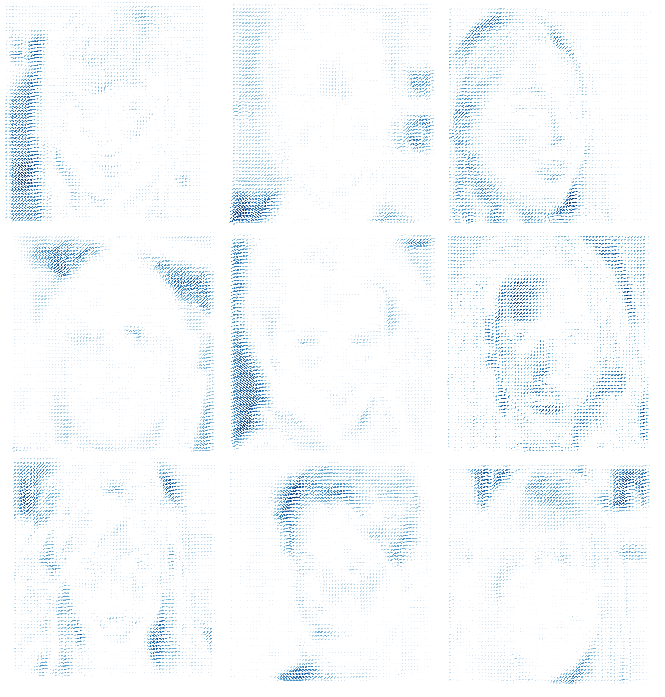
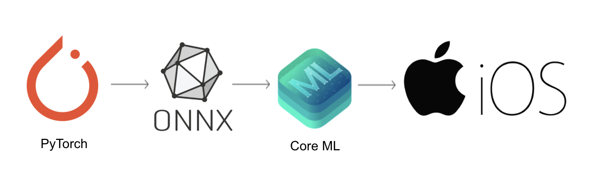

# Fast-fomm-mobile

The code was written by [Arman Tsaturyan](https://github.com/Arxtage), [Nikita Mokrov](https://github.com/Tismoney), [Ilya Selnitskiy](https://github.com/Silya-1) and [Ilya Zakharkin](https://github.com/izaharkin).

## About

The purpose of the project was to compress First-Order Motion Model for conditional image generation task to enable its real-time inference on mobile devices. We were inspired by three novel works: [First-Order Motion Model (FOMM)](https://papers.nips.cc/paper/8935-first-order-motion-model-for-image-animation), [GAN Compression](https://arxiv.org/abs/2003.08936)  and [StyleGAN2 Distillation](https://arxiv.org/abs/2003.03581), we came up with our approach that we call **2pix2pix**. The main idea was to gather a distilled dataset based on FOMM predictions, then train pix2pix  generator that is being fed 2 images: "source" and "driving", and predict the "target" image with it. Loss is calculated based on original FOMM predictions, so the aim of 2pix2pix is to predict as similar to FOMM as possible given absolutely the same input. We also benchmark all used models: FOMM, original pix2pix and compressed pix2pix on CPU, GPU and mobile processors. 

## Video

Please see a [svideo](https://www.youtube.com/watch?v=2hjGJ2D_66Q) of project presentation for more details.

## Prerequisites

- Linux or macOS
- Python 3
- CPU or NVIDIA GPU + CUDA 

## Description

### First Order Motion Model 

This is a fork of the original [FOMM model](https://github.com/AliaksandrSiarohin/first-order-model) we added a script [generation_syntetic_dataset_v3_recognition.py](generation_syntetic_dataset_v3_recognition.py) for creation synthetic dataset that consists of source image driving image and a predicted one, which is a result of transformation of the source image in a position of driving one. The example of FOMM inference presented bellow. Here is a [link](https://drive.google.com/drive/u/1/folders/1gZce8unaCcQBKu9OFKOiPRAo_itAPEmH) for the created dataset.

 

### Gan compression

The module is also a fork of the original [GAN Compression](https://github.com/mit-han-lab/gan-compression) model. But here we added some important improvenents. The first one is Dense Motion block. The second is adding [CoordConv block](https://arxiv.org/abs/1807.03247). 

 

Also the module contains [the demo notebook](https://github.com/Tismoney/gan-compression/blob/master/2pix2pix.ipynb) to launch our model.

### ONNX to Core ML Converter

This submodule is fork of [ONNX to Core ML Converter](https://github.com/onnx/onnx-coreml). The module aimed at converting PyTorch modules to Apple Core ML format. It's a special format for inference models on Apple devices. There is no straightforward solution to convert PyTorch models directly to CORE Ml, the intermediate conversion to ONNX format is used in this module.

 

 **Have look at gifs in [pics folder](https://github.com/Silya-1/fast-fomm-mobile/tree/master/pics)**
